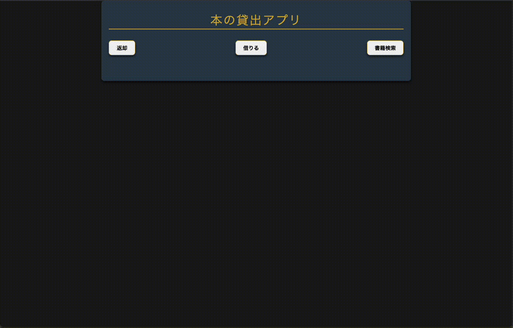

# 📚 Book Lending App - 本の貸出アプリ

This application is a **book lending management system** built with Google Apps Script (GAS).  
It provides core functions such as book search, lending, and return.  
Sample data is included in CSV format for testing and demonstration.

(このアプリは、Google Apps Script (GAS) を使用して構築された **書籍の貸出管理システム** です。  
書籍の検索・貸出・返却の基本的な機能を備えており、CSVによるサンプルデータも付属しています。)

---

## 👀 Preview - プレビュー

### 🔎 Book Search - 書籍検索

### 📕 Book Borrowing - 書籍の貸出

### 📗 Book Return - 書籍の返却

---

## 🗃 Sample Data - サンプルデータ

- Filename: `bookLendingApp_DB.csv`  
- Description: Contains sample book records, lending status, lend/return dates, etc.

- ファイル名：`bookLendingApp_DB.csv`  
- 内容：書籍タイトル、貸出ステータス、貸出日、返却日などを含むCSVデータ

---

## 🛠 使用技術

- Google Apps Script (GAS)
- Google スプレッドシート

---